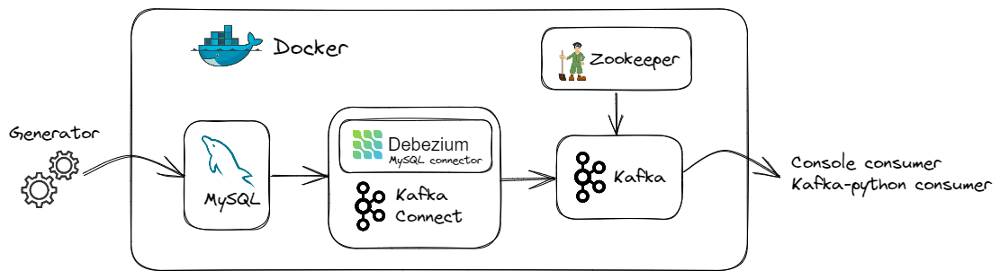
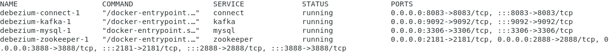
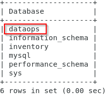
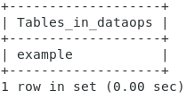
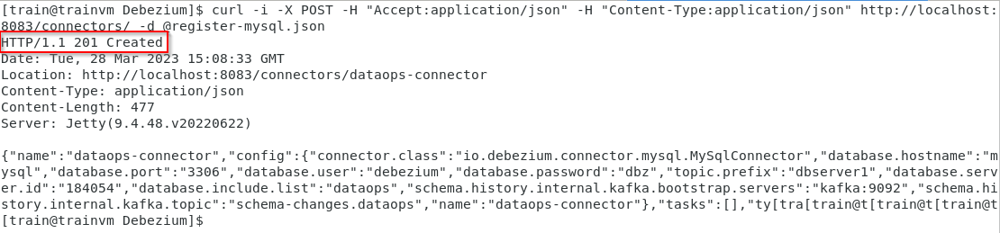
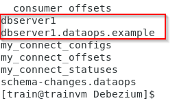
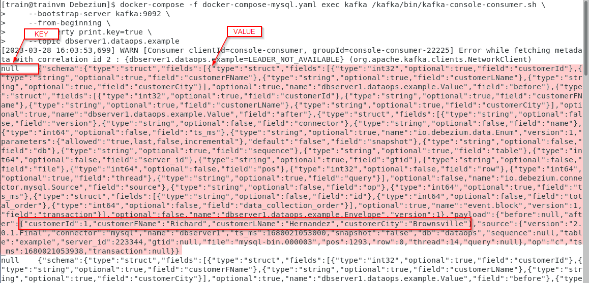
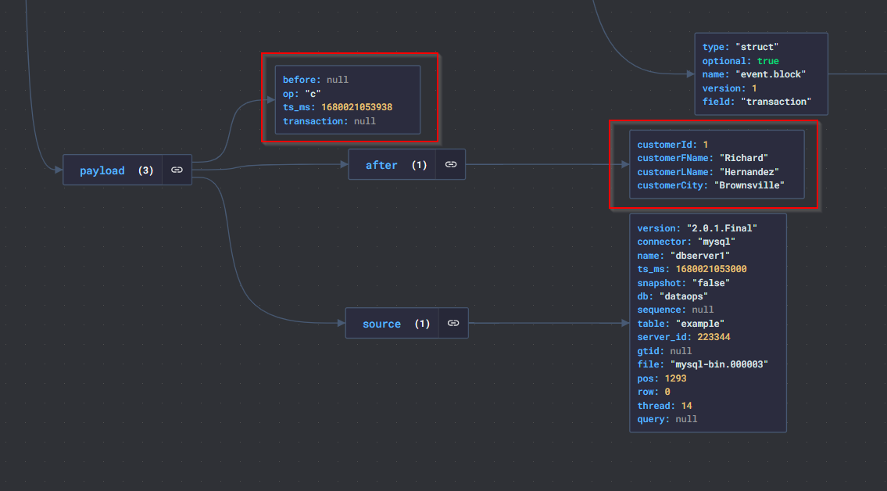
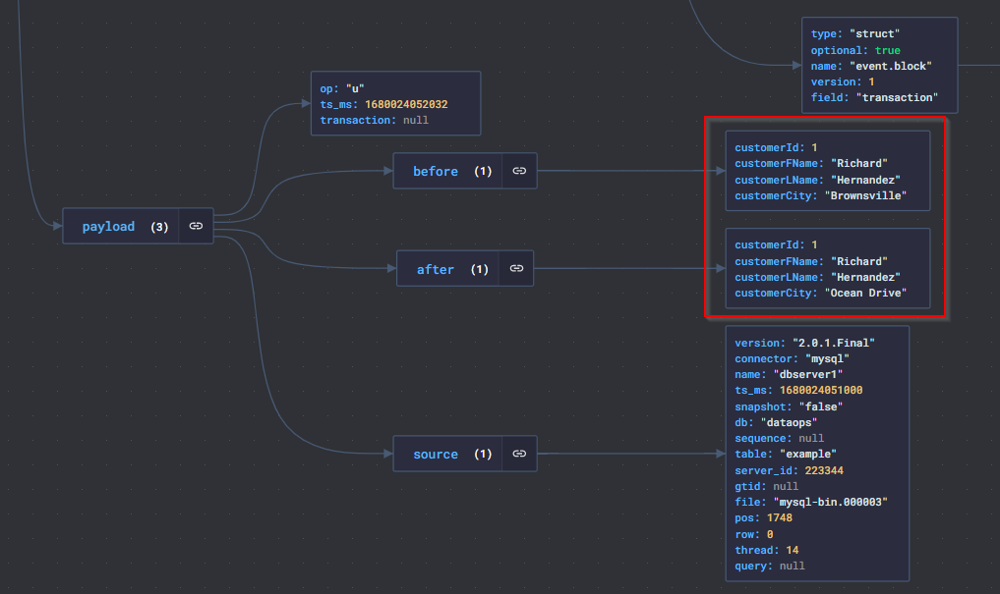
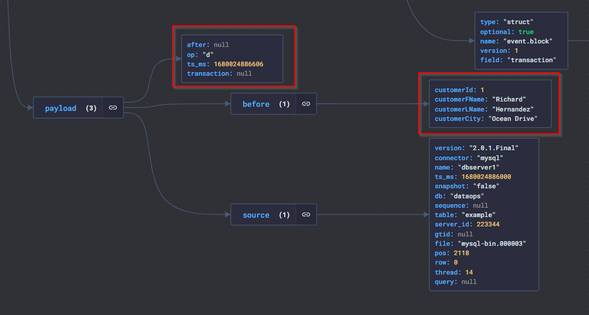

## Change-Data-Capture

Let’s say we want to capture changes in our database and move them seamlessly to another server/cloud, or we want to provide a real-time data stream for analysis/reporting. So how can we make this happen? To answer this, let’s get to know both the process of capturing data changes (Change Data Capture) and Debezium, a specialized tool for this, and observe this process in the MySQL database with an example.

### What is Change Data Capture?

CDC is a process that allows organizations to automatically identify and capture database changes. It provides real-time data movements by continuously capturing and processing data as soon as a database event occurs. There are different methods of performing the CDC process, but basically we can divide it into the following two categories:

Log-based (by tracking database transaction logs)
Query-based (with Trigger, Timestamp, Snapshot)
A common and effective use is the use of database transaction logs. While other methods impose additional load on the database (such as requiring a regular query in the “timestamp” method), this is not the case when reading existing transaction logs.

### What is Debezium and where is it located in the CDC process?
Based on its most common usage, Debezium is a tool built on top of Kafka that provides a set of Kafka Connect compatible connectors. It transforms information in your existing databases into event streams, allowing applications to detect and instantly respond to row-level changes in databases. For this, Debezium connectors must be present in the Kafka Connect cluster.

If we briefly touch on Kafka Connect due to its important role here, it is a Kafka-dependent tool that provides data flow between Apache Kafka and other systems in a scalable and reliable way. It is possible to easily define and manage connectors to the Kafka Connect cluster via the REST API interface.


Fig-1: Architecture of Debezium (Connector Role)

Debezium offers connectors for Cassandra, Db2, MongoDB, MySQL, Oracle Database, Postgresql, SQL Server, Vitess databases. Additionally, it can be used as an embedded library in custom Java applications or as a completely standalone server.

If we are ready, let’s start implementing!

### An example with Debezium MySQL Connector
We all know that the best way to understand a subject is to practice it. Now let’s see how what we talked about above happens with an application.

(Note: CentOS7 was used in the example study, operations were performed in the terminal.)



Fig-2: Diagram of Example Study

- To run the services shown in the diagram above, let’s use the [docker-compose-mysql.yaml](./docker-compose-mysql.yaml) file that Debezium offers in accordance with the steps described in its documentation. One of the important points here is the environment variables defined for “connect”. Debezium needs these variables. (For descriptions of variables, you can visit debezium/connect-base on docker hub.)

- Let’s run our services and check their status.
```
docker-compose -f docker-compose-mysql.yaml up -d
docker-compose -f docker-compose-mysql.yaml ps
```


Fig-3: Status of Containers

- Let’s connect to the MySQL database with the root user and view the current users. Mysqluser, seen in the image below, is the user defined when creating the container. We will then continue with the debezium user.
```
docker-compose -f docker-compose-mysql.yaml exec mysql bash -c 'mysql -u root -pdebezium'
```
```
SELECT user,host FROM mysql.user;
```


Fig-4: Mysql User List

- There are also existing databases in the MySQL docker image we use. Let’s create a new database named “dataops” and grant permissions to the debezium user. Let’s list the databases.

```
CREATE DATABASE dataops;
GRANT ALL ON dataops.* TO 'debezium'@'%';
FLUSH PRIVILEGES;
SHOW databases;
```



Fig-5: Database List

- Let’s exit the root user with Ctrl + D, connect with the debezium user and create a table named “example”. Let’s list our tables.

```
docker-compose -f docker-compose-mysql.yaml exec mysql bash -c 'mysql -u debezium -pdbz'
```
```
CREATE TABLE dataops.example(
    customerId int,
    customerFName varchar(255),
    customerLName varchar(255),
    customerCity varchar(255)
);
USE dataops;
SHOW tables;
```



Fig-6: Table List

Yes, our database and table are now ready. Let’s move on to our steps regarding Kafka and Kafka Connect.

- To define a connector to Kafka Connect, we need to define our information in a json file. Debezium again offers a resource for this. Let’s make small changes and set our json file as follows and briefly get to know a few configuration settings. (For all configuration settings, it will be useful to review Debezium’s website.)

  - name : The specific name of the connector. We gave it a new name here.
  - topic.prefix: Topic prefix for the MySQL server or cluster.
  - database.include.list : List of databases hosted by the specified server. We have specified the newly created database here. (Databases whose changes will be tracked will be included here.

```
 {

    "name": "dataops-connector",
    "config": {
        "connector.class": "io.debezium.connector.mysql.MySqlConnector",
        "database.hostname": "mysql",
        "database.port": "3306",
        "database.user": "debezium",
        "database.password": "dbz",
        "topic.prefix": "dbserver1",
        "database.server.id": "184054",
        "database.include.list": "dataops",
        "schema.history.internal.kafka.bootstrap.servers": "kafka:9092",
        "schema.history.internal.kafka.topic": "schema-changes.dataops"
    }
}
```

- Let’s open a new tab in the terminal and pass our connector information to Kafka Connect. Our connector was created as seen in Fig-7.

```
curl -i -X POST -H "Accept:application/json" -H  "Content-Type:application/json" http://localhost:8083/connectors/ -d @register-mysql.json
```


Fig-7: Information of created connector

- Let’s take a look at the Kafka topic list. If a topic has been created with the dbserver1 prefix, we can now start listening.

```
docker-compose -f docker-compose-mysql.yaml exec kafka /kafka/bin/kafka-topics.sh \
--bootstrap-server kafka:9092 \
--list
```



Fig-8: Kafka Topic List

- Now that we have seen the topics above, let’s open a new terminal and create a kafka-console-consumer that will listen to dbserver1.dataops.example as the topic. And from now on, we will be paying close attention to the changes in our MySQL database from this terminal. Great.

```
docker-compose -f docker-compose-mysql.yaml exec kafka /kafka/bin/kafka-console-consumer.sh \
    --bootstrap-server kafka:9092 \
    --from-beginning \
    --property print.key=true \
    --topic dbserver1.dataops.example
```

So, are we ready to make a change?

- First, let’s perform some data/record insertion operations in the terminal where MySQL is active.

```
INSERT INTO example VALUES (1,"Richard","Hernandez","Brownsville"),\
(2,"Mary","Barrett","Littleton"),\
(3,"Ann","Smith","Caguas"),\
(4,"Mary","Jones","San Marcos"),\
(5,"Robert","Hudson","Caguas");
```

- And let’s go to the terminal where kafka-console-consumer is active and see what happens.  As we can see below, the message of the change was received by the consumer as key-value. You will see that you receive messages for the 5 records we added.



Fig-9: Kafka Console Consumer

- Let’s examine the message (value) above with JSON Crack. What really interests us here is the information under the payload. As we can see in Figure-10, we have captured the change in the database before and after.

  - before : Current status of the record
  - after: The status of the record after the change
  - op: Type of operation performed (c: insert, u: update, d: delete)
  - ts_ms: Time information of the change



Fig-10: Insert a row

- Let’s try to update the data, for example, let’s say the city information of our customer number 1 has changed.

```
UPDATE example SET customerCity = 'Ocean Drive' WHERE customerId = 1;
When we examine the last message sent to Kafka-console-consumer, we can see that the update process is reflected as before-after.
```



Fig-11: Update a row

- Finally, let’s do a delete operation. What we need to pay attention to here is that when a record is deleted, two messages with the same “key” are sent and the “value” part of the second message has the value “null”. This record acts as a token for Kafka. (This means data with the key can be deleted by “log compaction“)

```
DELETE FROM example WHERE customerId = 1;
```


Fig-12: Delete a row

As we saw above, thanks to these tools, we were able to capture the changes in the database and retrieve the before-after status and other necessary metadata simultaneously. Of course, how we use this feature will vary depending on our business needs.

I hope you enjoyed this example.✌️

### Furthermore

You can also:

- Generate 2-3 batch data to simulate data flow using spark-mysql.py (If you have spark on your local machine)

- Update, Insert and Delete some records using python-mysql.py (or use mysql shell to do this operations)

- Examine console outputs via https://jsoncrack.com/editor

- Shut down the cluster

```
docker-compose -f docker-compose-mysql.yaml down
```
